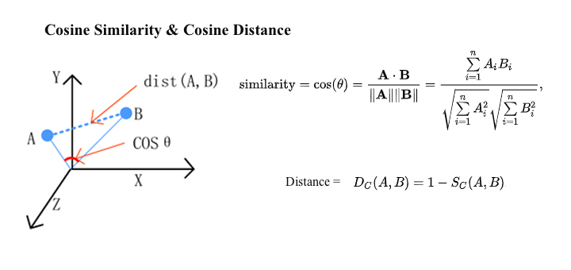

# 2 Way to caculate the distance two vector
## Formula

1. L2 Norm:
+ Min 0
+ Max: + vô cùng


2. Cosine distance.
+ Min : 0 -> 1.
+ Average: 90 -> 0.
+ Max: 180 -> -1
+ Convert: -1 -> 0 -> 1 <=> 2 <- 1 <- 0.(1 - result.)



## Milvus:
+ L2 Norm = np.sqrt(result) using L2.
+ Cosine = 1 - result using IP. `If you use IP to calculate embeddings similarities, you must normalize your embeddings.
After normalization, inner product equals cosine similarity`


```python
def cosine_distance(a, b, data_is_normalized=False):
    if not data_is_normalized:
        a = np.asarray(a) / np.linalg.norm(a, axis=1, keepdims=True)
        b = np.asarray(b) / np.linalg.norm(b, axis=1, keepdims=True)
    # from scipy.spatial import distance
    # dst = distance.cosine(a, b) = 1 - np.dot(a, b.T) = 1 - result_milvus.(with IP)
    return 1 - np.dot(a, b.T)


def distance_l2(a, b):
    # from scipy.spatial import distance
    # dst = distance.euclidean(a, b)
    # dst = np.sqrt(np.sum((a-b)**2)) = np.linalg.norm(a - b) = sqrt(result_milvus)(With L2)
    return np.linalg.norm(a - b)
```