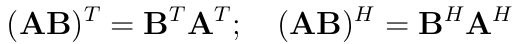

# Khái niệm
+ Định thức
+ Trị riêng và vector riêng
+ Độc lập tuyến tính.
+ Phụ thuộc tuyến tính.
+ Cơ sở(Basis).
+ Không gian sinh(Span).
+ Ma trận đơn vị.
+ Hạng của ma trân.
+ Ma trận ngịch đảo.
+ Chuẩn(Norm) của vector và ma trận.
+ Phép nhân ma trận.
+ Ma trận xác định dương.
+ Khử Gauss.

# Kí hiệu.

1. Chuyển vị(transpose) và Hermitian.
   + `Ma trận chuyển vị`: là ma trận được nhận từ ma trận cũ thông qua phép phản xạ gương qua đường chéo chính 
   của ma trận ban đầu. (T).
   + `Ma trận A đối xứng` (symmetric matrix): nếu A chuyển vị = A.
   + `Chuyển vị liên hợp` (conjugate transpose): là chuyển vị ma trận có phần tử là số phức. (H- Hermitian)
   + Nếu chuyển vị liên hợp của một ma trận phức bằng chính nó thì ta nói ma trận đó Hermitian.

2. Phép nhân hai ma trận.
   + Ma trận **A**(m x n), **B**(n x p), **C = AB** => **C**(m x p
   +  
   + Để nhân được hai ma trận số hàng của ma trận thứ nhất phải bằng số cột của ma trận thứ hai.
   + Các tính chất của phép nhân ma trận :
     + Không có tính chất giao hoán: AB # BA.
     + Có tính chất kết hợp: ABC = (AB)C = A(BC)
     + Phân phối với phép cộng: A(B + C) = AB + AC
     + Chuyển vị của một tích bằng tích các chuyển vị theo thứ tự ngược lại.
     + 