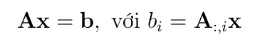

# Khái niệm
+ Định thức
+ Trị riêng và vector riêng
+ Độc lập tuyến tính.
+ Phụ thuộc tuyến tính.
+ Cơ sở(Basis).
+ Không gian sinh(Span).
+ Ma trận đơn vị.
+ Hạng của ma trân.
+ Ma trận ngịch đảo.
+ Chuẩn(Norm) của vector và ma trận.
+ Phép nhân ma trận.
+ Ma trận xác định dương.
+ Khử Gauss.

# Kí hiệu.

### 1. Chuyển vị(transpose) và Hermitian.
+ `Ma trận chuyển vị`: là ma trận được nhận từ ma trận cũ thông qua phép phản xạ gương qua đường chéo chính 
của ma trận ban đầu. (**A**T).
+ `Ma trận A đối xứng` (symmetric matrix): nếu **A**T = **A**.
+ `Chuyển vị liên hợp` (conjugate transpose): là chuyển vị ma trận có phần tử là số phức. (H- Hermitian)
+ Nếu chuyển vị liên hợp của một ma trận phức bằng chính nó thì ta nói ma trận đó Hermitian.

### 2. Phép nhân vô hướng.
**1. Tích vô hướng của ma trận(??)**
+ Ma trận **A**(m x n), **B**(n x p), **C = AB** => **C**(m x p)
  + 
+ Để nhân được hai ma trận số hàng của ma trận thứ nhất phải bằng số cột của ma trận thứ hai.
+ Các tính chất của phép nhân ma trận :
  + Không có tính chất giao hoán: **AB** # **BA**.
  + Có tính chất kết hợp: ABC = (**AB**)**C** = **A**(**BC)**
  + Phân phối với phép cộng: **A**(**B** + **C**) = **AB** + **AC**
  + Chuyển vị của một tích bằng tích các chuyển vị theo thứ tự ngược lại.
  + 
**2. Tích vô hướng của hai vector (Inner product).**
+ Theo định nghĩa trên nếu coi vector là một trường hợp đặc biệt của ma trận. Tích vô hướng của hai vector **x, y**(n x 1):
+ 
+ Nếu tích vô hướng của hai vector khác không bằng không. Hai vector đó vuông góc với nhau.
+ Ý nghĩa hình học Euclide:
+ 

**3. Tích vô hưởng của vector với ma trận.**
+ Phép nhân của một ma trận A(m x n) với vector x(n x 1) là một vector b (m x 1) 
+ 
### 3. Phép nhân có hướng.
**1. Nhân có hướng của ma trận (Hadamard hay element wise)**
+ Tích Hadamard của hai ma trận cùng kích thước A, B (m x n) là ma trận C (m x n):
+ 

**2. Nhân có hướng của hai vector** 
+ [ref](https://apecceosummit2017.com.vn/tich-vo-huong-tich-co-huong/)
+ Tích có hướng của hai vector la một vector giả có phương vuông góc với mặt phẳng chứa hai vector đầu vào, chiều 
theo quy tắc bàn tay phải.
+ 

### 4. Ma trận đơn vị(identity matrix) và ma trận nghịch đảo(inverse matrix).
**1. Ma trận đơn vị.**
   + `Đường chéo chính ` của một ma trận là tập hợp các điểm có chỉ số hàng và cột như nhau.
   + Một ma trận đơn vị bậc nlà một ma trận đặc biệt trong R (n x n) với các phần tử trên đường chéo chính bằng 1, 
   các phần tử còn lại bằng 0. (I - identity matrix )
   + Ma trận đơn vị I(n x n) bậc n có tính chất đặc biệt trong phép nhân:
     + A (m x n): AI = A.
     + B (n x m): IB = B.
     + **x**(n x 1): Ix = x.
   
**2. Ma trận nghịch đảo.**
   + Ma trận vuông **A** (n x n) là `khả nghịch(invertible, nonsingular hoặc nondegenerate)` nếu tồn tại ma trận vuông **B** (n x n) 
   sao cho **AB** = I. Ma trận **B** được gọi là ma trận nghịch đảo của **A**.
   + Nếu A khả nghịch thì ma trận nghịch đảo (B) thường kí hiệu là: A-1
   + Ý nghĩa:
   + 
   + Giả sử ma trận **A**, **B** khả nghịch thì tích của chúng cũng khả nghịch: (AB)-1 = B-1A-1. Giống 
    với tính chất chuyển vị của tích ma trận.
   
**3. Một số ma trận khác.**
+ Ma trận đường chéo (diagonal matrix ): Ma trận chỉ có các thành phần trên đường chéo khác 0.
+ Ma trận tam giác trên (upper triangular matrix ): ma trận có tất cả các thành phần dưới đường chéo chính = 0.
+ Ma trận tam giác dưới (lower triangular matrix )
+ Các hệ phương trình tuyến tính mà ma trận hệ số có dạng tam giác thường được quan tâm vì chúng có thể được giải với 
chi phí tính toán thấp.
+ Phép khử Gauss là thuật toán dùng để:
  + Tìm `nghiệm` của hệ phương trình tuyến tính.
  + Tìm `hạng` của một ma trận.
  + Tìm `ma trận nghịch đảo` của ma trận vuông khả nghịch.
    
### 5. Định thức(determinant)
+ Kí hiệu det(A) - định thức chỉ có ở ma trận vuông.
+ Định nghĩa.
+ Tính chất:
  + Một ma trận bất kì và chuyển vị của nó có định thức như nhau.
  + Định thức của ma trận đường chéo và vuông bằng tích các phần tử trên đường chéo chính.
  + Định thức của ma trận đơn vị bằng 1.
  + Định thức của một tích bằng tích các định thức.(A, B là hai ma trận vuông cùng chiều.)
  + Nếu một ma trận có một hàng hoặc một cột bằng 0 thì định thức của nó bằng 0.
  + Một ma trận khả nghịch khi và chỉ khi định thức của nó khác 0.
  + Nếu một ma trận khả nghịch thì định thức của ma trận nghịch đảo của nó bằng nghịch đảo định thức của nó..

### 6. Tổ hợp tuyển tính(Linear combination), không gian sinh(span space).
6.1 Tổ hợp tuyến tính.
+ Vector **a1, ..., an** (nx1), x1, ..., xn: **b** = **a1**x1 + ... + **an**xn. **b** được gọi là một tổ hợp tuyến tính 
của **a1, ..., an**.
+ Tương tự : **b** = **A**x **b** là một tổ hợp tuyến tính các cột của A.
+ Tập hợp tất cả các vector(**a1, .. an**) có thể biểu diễn được dưới dạng một tổ hợp tuyến tính các cột của ma trận A 
được gọi là `không gian sinh(span)` của các cột ma trận đó. Kí hiệu: span(**a1, .. an**)
+ Nếu phương trình : 0 = x1**a1** + x2**a2** + · · · + xn**an**:
  + Có nghiệm duy nhất `x1 = x2 = .. = xn = 0`.Ta nói hê {**a1, .. an**}: là một `hệ đôc lập tuyến tính`(linear independence)
  + Tồn tại `xi # 0` sao cho phương trình trên thỏa mãn. Ta nói đó là một hệ `phụ thuộc tuyến tính`.(linnear dependence)
  + Tính chất:
    + Một hệ là `phụ thuộc tuyến tính` nếu và chỉ nếu `tồn tại một vector` trong hệ đó là `tổ hợp tuyến tính` của các `vector còn lại`.
    + `Tập hợp con khác rỗng` của một hệ độc lập tuyến là một hệ `độc lập tuyến tính`.
    + Tập hợp các `cột của một ma trận khả nghịch` tạo thành một hệ `độc lập tuyến tính`.
    + Nếu **A** là ma trận cao (m > n) số hàng lớn hơn số cột thì tồn tại vector **b** sao cho **Ax** = **b** vô nghiêm.
    + Nếu n > m thì n vector bất kì trong không gian m chiều tạo thành một hệ phụ thuộc tuyến tính.
  
+ `Cơ sở(basic)` của một không gian:
  + Một hệ các vector {**a1, .. an**} trong không gian m chiều V = R(m) được gọi là `một cơ sở` nếu thỏa hai điều kiện:
    + V = span(**a1, .. an**).
    + {**a1, .. an**}: là một `hệ độc lập tuyến tính`.
  + Khi đó mọi vector **b** thuộc V điều có thể biểu diễn duy nhất dưới một tổ hợp tuyến của các **ai**.
  
+ `Range(Image) và Null space(Kernel)`:
  + R(A): là tập hợp các điểm là tổ hợp tuyến tính các cột của A. Hay chính là span các cột của A.
  + R(A): là một không gian con của R(m) với số chiều chính bằng số lượng lớn nhất các cột của A độc lập tuyến tính.
  + Mỗi vector trong N (A) chính là một bộ các hệ số làm cho tổ hợp tuyến tính các cột của A tạo thành một vector 0.
  + `dim(R(A)) + dim(N (A)) = n`

###7. Hạng(rank) của ma trận.
+ Xét **A**(m x n) hạng của **A** kí hiệu rank(**A**) được định nghĩa là `số lượng lớn nhất các cột` của nó tạo thành một hệ 
`độc lập tuyến tính`.
+ Tính chất:
  + Một ma trận có hạng bằng 0 khi và chỉ khi nó là ma trận 0.
  + Hạng của ma trận bằng hạng của ma trận chuyển vị.
  + Hạng của ma trận không thể lớn hơn số hàng hoặc số cột của nó. rank(**A**) ≤ min(m, n)
  + rank(**AB**) ≤ min(rank(**A**), rank(**B**))
  + rank(**A** + **B**) ≤ rank(**A**) + rank(**B**)
  + rank(**A**) + rank(**B**) − n ≤ rank(**AB**): **A** (m x n), **B** (n x k). Bất đằng thức : Sylvester về hạng.
  + Xét một ma trận vuông A(n x n) thì các điều dưới đây là tương đương:
    + **A** là một ma trận khả nghịch.
    + det(**A**) # 0.
    + Các cột của **A** tạo thành một cơ sở trong không gian n chiều.
    + rank(**A**) = n.

### 8. Hệ trưc chuẩn((orthonormal) , ma trận trực giao((orthogonal).
+ Một hệ cơ sở {**u1, .. , un**} thuộc R(m) được gọi là trực giao nếu mỗi vector khác không và tích hai vector bất kì bằng 0.
+ Một hệ cơ sở {**u1, .. , un**} thuộc R(m) được gọi là trực chuẩn nếu nó là một hệ trực giao và độ dài Euclidean (L2 Norm) của 
mỗi vector bằng 1.

